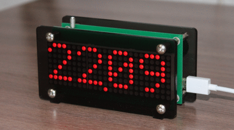

# Matrix Clock with Weather Station

Not too small, not too big, auto-syncing clock with wide viewing angle,
pretty bright at sunny day and not too bright at night, having a
simple weather station, without any wires except a Micro-USB power.

- Show clock, outdoor and indoor temperatures, indoor relative humidity, and
  atmospheric pressure
- Show the peak values and the change of any weather parameter for 24 hours
- Clock is wirelessly synced with a PC and maintained when the PC is offline
- Automatic brightness control
- Intuitively controlled with a single clickable rotary encoder on the back side

The project includes a base station with a LED matrix display, and two
wireless modules: for measuring outdoor temperature and syncing time with a PC.

 

The latter is just a wireless interface between a PC and the base station and
can be upgraded by software to make more complex stuff like showing arbitrary
things on the display, logging the weather, etc.

If for some reason the base station conclude that some data is unreliable, it show the
latest reliable data with a warning mark as a point in the bottom right corner.
Clock is unreliable if not synced with a PC for a week. Outdoor temperature is unreliable if no
data was received from the outdoor sensor for 10 minutes. Data from indoor sensors
is unreliable in case of any error.

If the battery in the outdoor module is low, a warning mark as a point in
the top right corner appears on the outdoor temperature screen.

It's a project I made for personal use in 2014 with some updates then.
It's based on my own preferences and ad hoc decisions. Also, it's my first
real-world electronic project after "LED blinking", and so have many design
lacks. Maybe I'll remake it some day. Anyway, I hope the sources can be useful
for someone.

## Technical details

The base station is a sandwich of two boards called in sources as `base` and
`matrix`. The `base` board contains an MCU, indoor sensors, RF module, and other
peripherals. The `matrix` board is just a SPI controlled 24×8 LED matrix.

The 5×8 font for the matrix is drawn in Plain PBM format, one character per
file. The ASCII map is defined in the `ascii` file. Finally, a Ruby script
`make-font.rb` generates the `font5x8.hpp` file included by the `matrix.cpp`.

The wireless modules for outdoor temperature measurement and time syncing are
called in sources as `outdoor` and `pc-link` respectively.

The `pc-link` module is connected to a PC by USB, and appears as a virtual
serial port (CP2102N chip is used for that). The module is controlled by
a Linux daemon `matrix-clock`. CP2102N also feeds 1 MHz clock signal
to the MCU. To make this work, the chip should be configured using
Silabs' [configuration tool](https://www.silabs.com/products/development-tools/software/simplicity-studio).

The wireless network is build on Nordic NRF24L01+ chips.
`base` is the primary receiver, `pc-link` transmits the current time, and
`outdoor` transmits the current temperature in Celsius and the battery level.

The front and rear glasses for the base station are made in
[Ponoko](https://www.ponoko.com/) by laser cutting from "acrylic gray tint"
material using the `case/base-station.svg` file.

The case for the outdoor module is 3D printed from the `case/outdoor-case.stl`
and `case/outdoor-cover.stl` files.

## License

Creative Commons Zero 1.0

